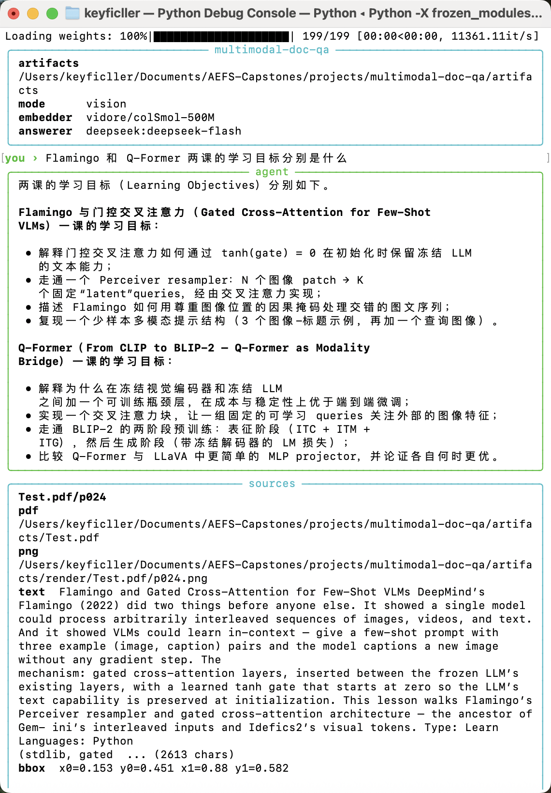
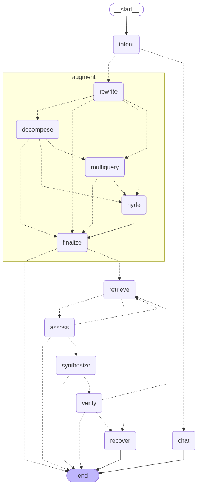

# multimodal-doc-qa

把文档页当图像检索，再用有界 agent 循环带引用作答。同一张图、同一张图结构，只换 retriever，对照 vision-first（ColPali 多向量 / MaxSim）和 OCR-first（页文本 / bge-small）。评测用自建语料，不跟公开榜比。



上面这次问的是 Flamingo 和 Q-Former 两课的学习目标。模型在跑的时候终端上一行 `working…`，跑完收掉，再打绿色答案面板和青色 `sources` 面板：这一问引的是 `Test.pdf/p024`，带归一化 bbox。

循环骨架：`plan` → `retrieve` → `assess` ⟲ → `synthesize` → `verify` ⟲，页面池空了或轮数用尽走 `recover`。实线是往下走，虚线是打回或收口。



> `graph.png` 是跑 demo 时顺手产出的，不是自动生成的：拓扑改了就重跑一次
> `uv run --no-project python -m multimodal_doc_qa.graph`。这条命令会先写图，再加载编码器、把语料页建进内存索引、真的问一题。

## 跑起来

在仓库根目录（环境是仓库级共享的，一个 `.venv` 所有项目通用）：

```bash
uv venv && uv pip install -r requirements.txt   # 只需一次
brew install tesseract                           # 扫描页的 OCR 臂要它

uv run --no-project python -m multimodal_doc_qa.corpus.generate
uv run --no-project doc-qa ingest \
  --corpus projects/multimodal-doc-qa/src/multimodal_doc_qa/corpus/_artifacts

uv run --no-project doc-qa                       # 多轮 REPL，默认 vision
uv run --no-project pytest projects/multimodal-doc-qa/tests -q -m "not slow"
```

`ask` / REPL / `eval` 调 DeepSeek。CLI 自己读仓库根的 `local.env`，已经在环境里的同名变量不会被盖掉。需要 `DEEPSEEK_API_KEY`。

默认视觉编码器是 `vidore/colSmol-500M`，OCR 臂是 `BAAI/bge-small-en-v1.5`，作答是 `deepseek:deepseek-flash`。换编码器必须重新 `ingest`：索引里不记 checkpoint，维数碰巧一样时会静默给出错误分数。

`--corpus` 接受 `pdf`、图片（`png` / `jpg` / `jpeg` / `webp`）、`txt`、`md`。PDF 和图片走 `encode_images`。纯文本按块切开，用同一个视觉编码器的 `encode_texts` 进视觉索引，不光栅化。字节相同的后一份文件跳过。只有一份文件时 `doc_id` 是词干；同一个词干有两份时，`doc_id` 用完整文件名，两份都入库。

## 问问题

不带子命令就是 REPL。两条索引启动时都加载好，`--mode` 只决定开场停在哪一条。提示符 `you ›`，下面的状态栏是当前路径和编码器。`Shift-Tab` 切换 vision / ocr，不再加载模型。空行忽略。`:q`、Ctrl-C、Ctrl-D 退出；一轮还在跑时 Ctrl-C 只取消这一轮。

只问一句：

```bash
uv run --no-project doc-qa ask "In doc000 page 0, what is stated about segment margin?"
uv run --no-project doc-qa ask "..." --mode ocr
```

引用面板只打印这份材料真正有的文件：文本页不出现 pdf 和 png。检索在 top-k 之后还要过分数线，低于本轮最高分 `MDQ_MIN_SCORE_RATIO`（默认 `0.5`）的页不进结果。

一轮的预算是检索 5 轮、模型调用 16 次、token 20 万、墙钟 120 秒。正常结束不打印 `stop_reason`。`recover_empty` 是一页都没检索到；`recover_exhausted` 是轮数用尽（答案通常已经有了）；`budget_exhausted` 是撞上调用数、token 或墙钟。

## 目录

| 路径 | 作用 |
| --- | --- |
| `src/multimodal_doc_qa/graph.py` | 图装配（plan / retrieve / assess / synthesize / verify / recover） |
| `src/multimodal_doc_qa/cli.py` | `ingest` / `ask` / `eval` / REPL |
| `src/multimodal_doc_qa/embed/` | 视觉多向量编码器（页图 `encode_images`，文档文本 `encode_texts`，问题 `encode_query`） |
| `src/multimodal_doc_qa/index/` | torch MaxSim |
| `src/multimodal_doc_qa/retrievers/` | vision 与 OCR 两条 `BaseRetriever` |
| `src/multimodal_doc_qa/baseline/` | PDF 文本层或 Tesseract，再分块 |
| `src/multimodal_doc_qa/synth/` | 带引用的结构化作答 |
| `src/multimodal_doc_qa/ui/console.py` | 终端渲染，唯一写控制台的地方 |
| `src/multimodal_doc_qa/ui/viewer.py` | Streamlit：金标框 / 引用框，vision 与 OCR 并排 |
| `src/multimodal_doc_qa/corpus/` | 合成语料 |
| `src/multimodal_doc_qa/eval/` | nDCG@k、IoU、结果 JSONL |
| `docs/使用说明.md` | 命令、配置表、查看器 |
| `PROJECT.md` | 架构、预算、评测口径的唯一来源 |
| `tests/` | 单测；`slow` 才加载真实模型 |

## 评测

两条手臂分开落盘，查看器才能并排：

```bash
uv run --no-project doc-qa eval --mode vision \
  --questions projects/multimodal-doc-qa/src/multimodal_doc_qa/corpus/_artifacts/questions.json \
  --out projects/multimodal-doc-qa/eval/vision.jsonl

uv run --no-project doc-qa eval --mode ocr \
  --questions projects/multimodal-doc-qa/src/multimodal_doc_qa/corpus/_artifacts/questions.json \
  --out projects/multimodal-doc-qa/eval/ocr.jsonl
```

终端打的是 `nDCG@5`（检索器自己的排序）、`IoU@0.5`（主指标）、严格包含只作参照，外加延迟 p50/p95 和 token。默认生成器只有 6 页 / 8 问，这个规模上的数字只能证明流水线通，不能拿来比两条手臂。口径见 `PROJECT.md`。
