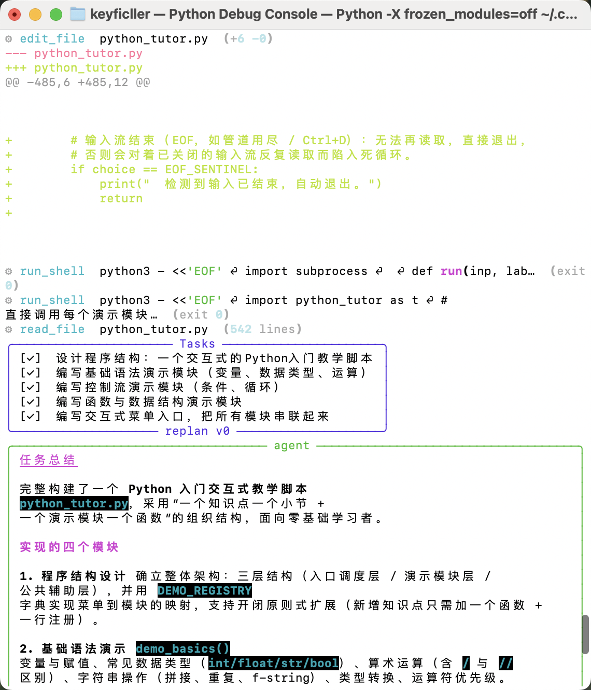
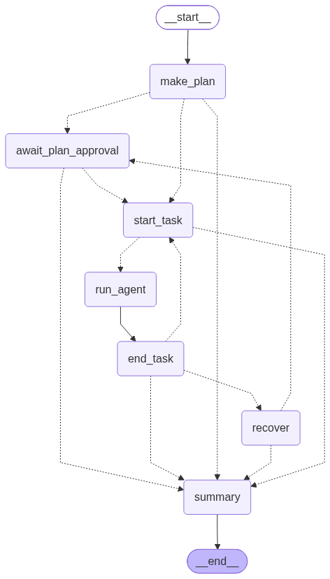

# terminal-coding-agent

终端里的 coding agent：你用自然语言提任务，它在隔离 worktree 内读代码、改文件、跑命令，交出一份 patch；要一段内容（写／解释／翻译，或"把某个文件给我看看"）的请求则直接作答，不产生 patch。



循环骨架：`make_plan` → `start_task` / `run_agent` / `end_task` → `recover` → `summary`。Act 只分派工具，Observe 截断输出回填，Recover 把失败当 Observation 重排计划（上界 3 次），所有终止路径都汇到 `summary` 写 trace。CLI 另有一条直答短路径：planner 判为 `answer` 的请求走 `make_plan` → `answer` → `summary`，不产生 todo；下图 `graph.png` 是**未开该分支**的默认拓扑。



## 输入前缀

REPL 里一行可以带三种前缀（行首 `\` 转义可让整行当普通任务）：

| 前缀 | 例子 | 行为 |
| --- | --- | --- |
| `@path` | `把 @NOTES.md 的内容给我看看` | 把文件内容附到该轮消息；`png/jpg/jpeg/webp/gif`（≤5 MB）转成图片块交给模型，其余按 UTF-8 文本读入并截断至 4k tokens。路径须在 worktree 内。 |
| `!cmd` | `!pytest -q` | 在 worktree 里直接跑 shell，输出就地显示；**不进对话上下文、不计预算**，也不走破坏性命令守卫。 |
| `/cmd` | `/help`、`/quit` | 该次 REPL 的命令表（`repl-console`）：`LocalCommand` 只在本地动作，`PromptCommand` 展开成 prompt 再进图。同名后传入的命令替换内置。 |

在真实终端下主提示用 `prompt_toolkit`，输入 `@` 补文件路径、行首 `/` 补命令名；管道/无 tty 时自动回退到 `input()`（补全关闭），Harbor 侧不装 `prompt_toolkit`。

## 跑起来

```bash
./start.sh setup                                                  # 共享 .venv + 依赖，只需一次
./start.sh run terminal-coding-agent                              # 多轮 REPL；默认只写临时 worktree，退出即删
./start.sh run terminal-coding-agent --worktree /path/to/repo     # 真改代码；--session <id> 可续跑
./start.sh test projects/terminal-coding-agent                    # 单测
bash projects/terminal-coding-agent/scripts/verify_harbor_tasks_local.sh   # 任务集双向验证（真 Docker，不用 LLM / Harbor）
```

评测跑批（`harbor run`，需要 `local.env` 里的 `DEEPSEEK_API_KEY`）与实测口径见 `PROJECT.md`。
