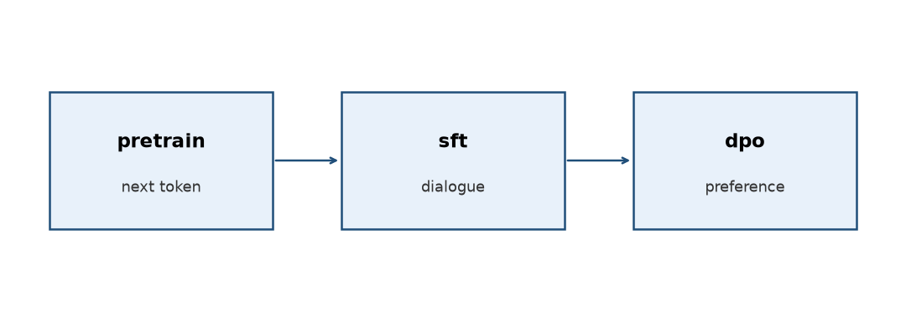

# tiny-llm-pipeline

从零训练一个 ~29M 的中文小模型（MiniMind2-Small 配置：词表 6400、宽 512、8 层）：预训练接龙 → SFT → DPO 对齐豆包体。交付权重、tokenizer 与训练日志在 `checkpoints/`。



## 跑起来

```bash
./start.sh setup                                        # 共享 .venv + 依赖，只需一次
./start.sh test projects/tiny-llm-pipeline/tests        # 单测

P=projects/tiny-llm-pipeline
./start.sh run tiny-llm-pipeline prepare --out $P/artifacts/data       # 拉语料 → 训 tokenizer → 打包 bins 与切分
./start.sh run tiny-llm-pipeline synth-pref --n 400 \                 # 合成偏好对；追加式，中断可续跑
    --prompts $P/artifacts/data/dpo_prompts.jsonl \
    --out $P/artifacts/prefs/prefs.jsonl --data $P/artifacts/data
./start.sh run tiny-llm-pipeline train-pretrain --data $P/artifacts/data --out $P/artifacts/pretrain
./start.sh run tiny-llm-pipeline train-sft --data $P/artifacts/data \
    --base $P/artifacts/pretrain/ckpt.pt --out $P/artifacts/sft --max-steps 5000
./start.sh run tiny-llm-pipeline train-dpo --data $P/artifacts/data \  # 交付配置
    --prefs $P/artifacts/prefs/prefs.jsonl --ref $P/checkpoints/sft/ckpt.pt \
    --out $P/artifacts/dpo --beta 0.01 --epochs 4 --lr 3e-5           # --ref 全程只读
```

想先验证整条链能跑：三处 `--max-steps` 设成 `3`，`train-sft` 加 `--limit 32`（`sft_train.jsonl` 有 112 万行，逐行流式读）。

`synth-pref` 需要 `DEEPSEEK_API_KEY`（`./start.sh run` 不代读仓库根 `local.env`，先自行 export）。`--max-steps` 是绝对值，而且决定余弦视野：`--resume` 时只调大它会抬高学习率，要延长训练得保持原视野或显式给更长的计划。

## 结果

| stage | 步数 | 指标 | 权重 |
| --- | --- | --- | --- |
| pretrain | 34500 | val ppl **11.8** | `checkpoints/pretrain/` |
| sft | 5000 | 留出集回答 ppl **6.34**（微调前 **38.15**） | `checkpoints/sft/` |
| dpo | 104 | Δ = `logπ_chosen − logπ_rejected`：**−197.8 → +331.9**，Δ>0 的偏好对 **22% → 64%** | `checkpoints/dpo/` |

生成时开 `repetition_penalty`（`1.3–1.5`，`eval/sample.py` 默认 `1.5`）。

## 抽样

```bash
./start.sh run python projects/tiny-llm-pipeline/eval/sample.py \
    --rep-pen 1.5 --top-k 40 --top-p 0.9 --html $P/eval/replies.html
```

默认读 `checkpoints/` 的三段权重，默认 3 个 prompt（`--prompt` 覆盖，可重复）。种子由 `(seed, stage, rep_pen, prompt, index)` 派生，同一批可复现、与执行顺序无关。6 个问题 × 三段的 18 条实测回复见 [`eval/replies.html`](eval/replies.html)。

## 三阶段对照页

```bash
./start.sh run python projects/tiny-llm-pipeline/eval/serve.py --open
```

打开 `http://127.0.0.1:8000/`，输入一个问题，点「生成」：`pretrain` / `sft` / `dpo` 三栏并排各给一条回复，每栏带 `chars` / `dist4` / `tempo` 三项读数。默认 `rep_pen=1.5`、`temperature=0`（贪心）、`max_new=64`，页面可改。生成与读数口径与 `sample.py` 共用 `src/tiny_llm_pipeline/generate.py`。

只绑 `127.0.0.1`、无鉴权、**不落盘**（刷新即清空，要留档用上面的 `--html`）。三段权重启动时一起常驻，约 350 MB，起服务后要等它加载完。

`checkpoints/` 与 `artifacts/data/` 被 gitignore，新机器 `git clone` 拿不到；`artifacts/prefs/` 要随机器搬运（`prefs.jsonl` 需调 API 生成）。完整口径、调参扫描与跨机清单见 [`PROJECT.md`](PROJECT.md)。
